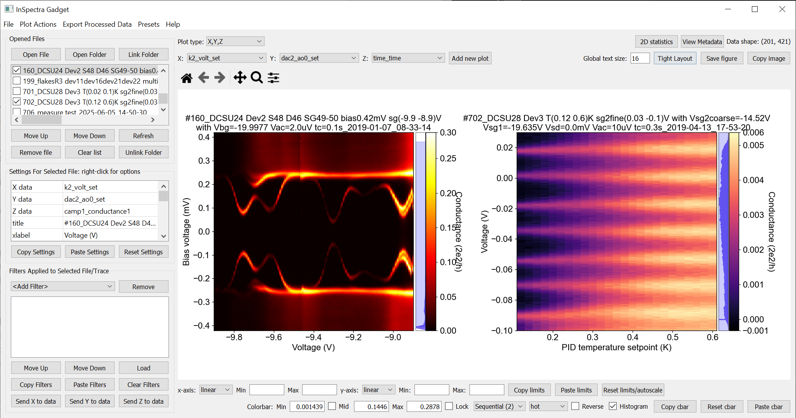
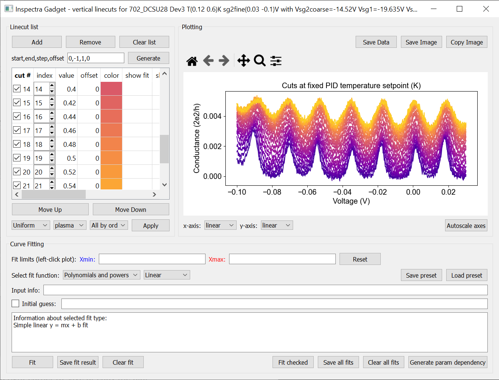
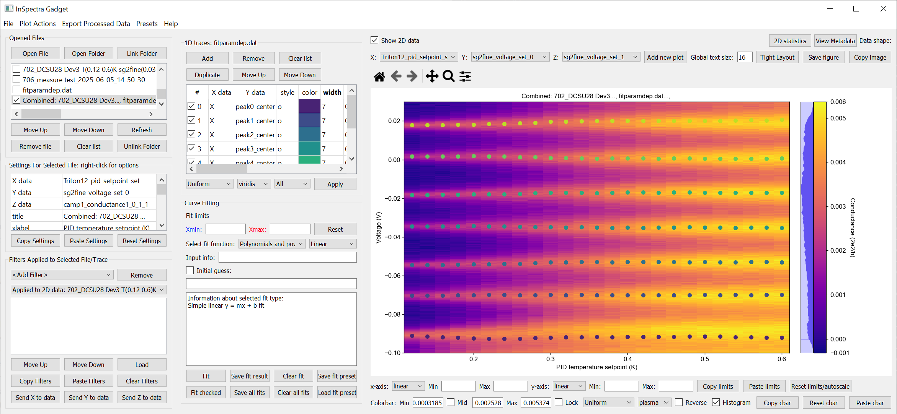

Offline plotting, a.k.a. InSpectra Gadget
=========================================

Offline plotting is opened by running
``qcodespp.offline_plotting()`` 

If you have declared ``qcodespp.set_data_folder('foldername')``, data from that folder will automatically be opened. Alternatively, you can write ``qcodespp.offline_plotting(folder=path_to_folder)`` to open a different folder. Otherwise, the initial state is blank.

Basic plotting
--------------
- Load data by clicking the 'Open File' button in the top left corner, or by opening/linking a folder (see below).
- If the data is 1D, a line trace will be plotted, and if it is 2D, it will plot a color plot.
- Below the 'Opened files' box is a table of 'Settings for Selected File'. For colourplots, the plotted parameters are changed by right-clicking on the relevant value. You can change other appearance settings, with preset values accessible by right-clicking.
- Immediately above the plot windows are the usual matplotlib tools for panning and zooming. Reset the view with the 'home' button.
- You can also zoom using the mousewheel. Zooming while holding ctrl(shift) zooms only on the x(y) axis.
- Underneath the plot are settings related to the axes, including the colourbar. You can choose the colourmap type, the range, etc.
- The colorbar is accompanied by a histogram. To adjust the range of the colorbar, change the limits of the blue shaded region by clicking and dragging.
- For 1D data, extra options will appear when the file name is clicked. You can add multiple lines from the same dataset to the same plot; change the parameters by right-clicking on the parameter name(s).
- Linestyle and colour can also be changed by rightclicking.
- Basic uncertainty plotting is supported for 1D data. For fixed values, enter the value, and for a percentage error enter e.g. '10%'. The uncertainties can also be loaded from another column in the dataset by right-clicking on the relevant cell in the table. (see below for how filters (do not) affect uncertainties).
- You can also perform fits to 1D data (see below)
- When you are done, you can click 'Save' or 'Copy' in the top right corner to save or copy the plot as an image. The saved pdfs work very well in Adobe Illustrator.

Plot types
^^^^^^^^^^
`Histograms <https://numpy.org/doc/stable/reference/generated/numpy.histogram.html>`__ and `Fast Fourier Transforms (FFTs) <a href=https://numpy.org/doc/stable/reference/generated/numpy.fft.rfft.htm>`__ of the data can be plotted by selecting the appropriate 'Plot type' at the top of the window. 

- For histograms, you can choose the number of bins either next to the 'plot type' menu (for 2D data) or line-by-line in the Traces table (for 1D data). 
- FFTs are plotted against the `calculated frequencies <a href=https://numpy.org/doc/stable/reference/generated/numpy.fft.fftfreq.html>`__. For this to be meaningful, the original data must be on an evenly-sampled grid. At current, you will have to interpolate your data to resample it onto an evenly-spaced grid. This may become automatic in future.

Fitting
^^^^^^^
- The fitting is basically a GUI for `lmfit <a href=https://lmfit.github.io/lmfit-py/>`__, with almost all built-in models implemented. See `here for a description of each model/function <a href=https://lmfit.github.io/lmfit-py/builtin_models.html>`__.
- To limit the fitting range, fill out the Xmin and Xmax fields, OR, click twice on the plot area. Lower limit first, upper limit second.
- You almost always need to provide some 'Input info'; might be the polynomial order, or the number of peaks to fit. The info is given in the box at the bottom of the window.
- Optionally, you can provide an initial guess for the fit parameters; see the info box for how to format your inputs correctly. See note about initial guesses and fitting below*
- If there is not a model suited to your needs, use 'User input'/'Expression'. `You can input anything you want and fit it! <a href=https://lmfit.github.io/lmfit-py/builtin_models.html#lmfit.models.ExpressionModel>`__
- The 'custom' models include some fits relevant for electron transport, using the basic lmfit Model. If you have a working lmfit Model for a function not included here, send me the code and I'll implement it.
- 'Save fit result' saves the fit result using ``lmfit.model.save_modelresult`` `(docs) <https://lmfit.github.io/lmfit-py/model.html#lmfit.model.save_modelresult>`__. You can use lmfit.model.load_modelresult('file_location') `(docs) <https://lmfit.github.io/lmfit-py/model.html#lmfit.model.load_modelresult>`__ to load the fit result into a notebook for further analysis.
- You can fit all of the checked lines using the same fitting options using the 'Fit checked' button. You can save all the results as lmfit model results (I suggest making a new folder before saving!!).
- Finally, you can also calculate statistics under 'fitting'. This isn't really fitting of course, it just calculates the listed values using the relevant numpy function (i.e. no lmfit involved). The statistics are saved as a .json file.

Filters
^^^^^^^
'Filters' in InSpectra Gadget are simply mathematical operations that can be performed on the data. The filters thus handle everything from applying offsets to any of the axes, to doing numerical differentiation. 

- You can add multiple instances of the same filter type, change the order they are applied in and turn them off and on. 
- You can export the data if you need to work with the results in another program/notebook (see below for more). 
- You can also export the filters/settings, and load them later on other datasets. 
- Finally, and importantly, you can 'send' the filtered data to the current dataset, to plot it on another axis, or simply use it later.

Each available filter has up to two options (which, since they aren't listed in the app itself, here they are):

.. list-table::
    :widths: 20 20 20 40
    :header-rows: 1

    * - Filter type
      - Option 1
      - Option 2
      - Info
    * - `Derivative <https://numpy.org/doc/stable/reference/generated/numpy.gradient.html>`__
      - Order in x
      - Order in y
      - n-th derivative in x and/or y
    * - `Integrate <https://numpy.org/doc/2.2/reference/generated/numpy.cumsum.html>`__
      - Order in x
      - Order in y
      - Numerically integrate (i.e. perform the cumulative sum) n times in x and/or y. Only works for regular x and y data.
    * - `Smoothen <https://docs.scipy.org/doc/scipy-1.15.2/reference/generated/scipy.ndimage.gaussian_filter.html>`__
      - smoothing window in x
      - smoothing window in y
      - `Gaussian <https://docs.scipy.org/doc/scipy-1.15.2/reference/generated/scipy.ndimage.gaussian_filter.html>`__ or `median <https://docs.scipy.org/doc/scipy-1.15.2/reference/generated/scipy.ndimage.median_filter.html#scipy.ndimage.median_filter>`__ filtering
    * - `Savitzy-Golay <https://docs.scipy.org/doc/scipy/reference/generated/scipy.signal.savgol_filter.html>`__
      - smoothing window
      - polynomial order
      - Savitzy-Golay smoothing/filtering applied along one axis
    * - Add/Subtract
      - value
      - n/a
      - Add/subtract a fixed value to any axis. Also available by right-clicking on plot area as 'Offset <axis> by X'. To add/subtract another parameter from the same dataset, right click on the offset value. To subtract, place a '-' in front of the parameter name.
    * - Multiply
      - multiplication factor
      - n/a
      - X*factor; useful to convert e.g. V to mV. To multiply by another parameter from the same dataset, right click on the value to choose.
    * - Divide
      - division factor
      - n/a
      - X/factor. To divide by another parameter from the same dataset, right click on the value to choose.
    * - Add slope
      - value of slope in x
      - value of slope in y
      - Slope is multiplied to x and/or y. Useful to e.g. subtract series resistance
    * - Invert
      - n/a
      - n/a
      - perform 1/x, 1/y or 1/z 
    * - Normalize
      - x-coordinate of point
      - y-coordinate of point
      - Normalise z-data (or y-data if 1D) to min, max, or specified point
    * - Subtract average
      - n/a
      - n/a
      - Subtract average of data from data
    * - Offset line by line
      - index
      - n/a
      - For each line in a 2D dataset, subtract the value at the given index, within that line. Used if you know that the n-th index of each line should be zero.
    * - Subtract average line by line
      - n/a
      - n/a
      - For each line in a 2D dataset, subtract the average of values in that line.
    * - Subtract trace
      - index
      - n/a
      - 2D data only. Subtract the linetrace at the given index from all other lines in the data.
    * - Logarithm
      - base
      - n/a
      - logarithm to base 10, 2 or e (default 10). The Mask, Offset and Abs options deals with negative values. 'Mask' ignores them, 'Offset' offsets all data by the minimum value in the data, and 'Abs' takes the absolute value of the data. Only for z data; for x,y use axis scaling below plot window
    * - Power
      - exponent
      - n/a
      - performs x^exponent
    * - Root
      - exponent of the root
      - n/a
      - performs abs(x)^(1/exponent) if exponent>0
    * - Absolute
      - n/a
      - n/a
      - Absolute value of data 
    * - `Flip <https://numpy.org/doc/2.2/reference/generated/numpy.flip.html>`__
      - n/a
      - n/a
      - Flips the data along the x-axis (1D) or y-axis (2D)
    * - `Interpolate <https://docs.scipy.org/doc/scipy/reference/interpolate.html>`__
      - number of data points in x
      - number of data points in y
      - Interpolates the data to the given number of points in x and/or y
    * - `Roll X <https://numpy.org/doc/2.2/reference/generated/numpy.roll.html>`__
      - position
      - amount
      - Rolls the data in x by the given amount, starting at the given position
    * - `Roll Y <https://numpy.org/doc/2.2/reference/generated/numpy.roll.html>`__
      - position
      - amount
      - Rolls the data in y by the given amount, starting at the given position
    * - Crop X
      - Minimum X
      - Maximum X
      - Not just zooming; relevant if e.g. you want to apply a filter only to a section of the data. Available also by right-clicking on the plot window
    * - Crop Y
      - Minimum Y
      - Maximum Y
      - (2D data only) As above
    * - Cut X
      - left
      - width
      - Cuts the data in x, starting at the given position and with the given width
    * - Cut Y
      - bottom
      - width
      - Cuts the data in y, starting at the given position and with the given width
    * - Swap X/Y
      - n/a
      - n/a
      - Swaps the x and y axes of the data, i.e. plots y as a function of x and vice versa

**Filters and uncertainties**

Since it is extremely non-obvious how various filters may affect uncertainties in different situations, only scalar multiplication and division filters are applied to uncertainties (basically to facilitate unit scaling, e.g. from volt to millivolt). In general, if you are performing any of the above operations, you should re-calculate your uncertainties manually.

**Filters and irregular or non-monotonic x/y**

Even though it's possible to plot irregular and non-monotonic x/y/z data (as long as the arrays are of the correct shape), the way that filters are applied often assume at least monotonic x and y. For example, Crop X and Crop Y are based on the *array indices* not the absolute value on the x or y axis. Similarly, the integral is only calculated correctly if X (or Y) are regular. Conversely, the derivative *is* calculated correctly for irregular X (or Y). If you apply a filter to irregular data, it is worth to peek into the code to see what the filter is actually doing. As time goes on we will try to make the filters more friendly to irregular data.

Linecuts
--------

- To make a horizontal(vertical) linecut, left-click(middle-click) at the desired location on the plot.
- Alternatively, right click on the plot area and select the relevant option.
- You can change the index at which the cut is made, the offset on the y-axis, and the colour of the line.
- You can add further cuts by clicking again, or manually adding them in the linecut window.
- To generate a series of linecuts, specify (the indices) start, end, step and y-axis offset. Use -1 as end index to call the last index. It's probably not a smart idea to plot every line if you have hundreds of lines; it will use a lot of memory.
- Once you have your linecuts, you can also apply a colourmap to their linecolors by selecting which colormap to use, how to apply it, and clicking 'Apply'
- You can also access the linecuts by right-clicking on the plot area. Here you also have the option to plot 'diagonal' linecuts, i.e. cuts along an arbitrary direction in the x-y plane, and circular linecuts.

Fitting linecuts
^^^^^^^^^^^^^^^^
- The fitting is almost the same as in the 1D plotting case.
- An important difference is that you can now Generate a parameter dependency. This file has the value of the parent axis as one column, and all parameters from the lmfit result(s) as the other columns. The file is automatically added to the file list in the main window. You can then plot each fit parameter as a function of the parent parameter.

Working with multiple files
---------------------------
- To open another data file, just click 'Open File' again. Data from the new file will be plotted.
- To see data from both files side-by-side, activate the checkbox next to the original file. You now have two plots!
- To change the spacing between the plots and the whitespace above and below, use the middle mouse scrolling when hovering over the relevant region.
- IMPORTANT: To set values such as labels, tick parameters, axis ranges, first either click on the filename corresponding to the plot you want to edit (not the checkbox) or somewhere on the plot area, to bring the correct file/plot/data into focus.
- To change the order of the plots, you change the order of the files in the list using 'move up' and 'move down'.
- To add a new plot with different sets of parameters from the *same* dataset, use the X,Y,(Z) boxes above the plot window and click 'Add new plot'. This duplicates the file in the file list. You can do this manually by right-clicking on the file and choosing 'Duplicate', or with Ctrl+D.
- Duplicating a file will *not* carry over any linecuts or fits. It is quite hard to implement. If it *really* becomes relevant I can look into it.

Working with an entire folder
-----------------------------
You can open data from an entire folder in two ways. 

- You can select 'Open Folder' and choose the relevant folder. This will load the list of all the datasets found in that folder *and all sub-folders*. The data itself will not be loaded until you click the checkbox to plot it. This is because the data gets loaded into memory, which *might* start to affect your computer's performance. However, unchecking a file does *not* free up memory. 'Remove file' and 'Clear list' *should* do it, but this is hard to troubleshoot. Certainly refreshing the kernel works.

- You can also 'link' to a folder with ongoing measurements by clicking 'Link Folder'. Initially this will perform the same action as 'Open Folder', but now when you click 'Refresh', any new data will be added automatically to the list of Opened Files. (If you enable 'Track data' for the linked folder, on-going measurements will be tracked, with an update period of 30s. However, it's really not recommended because the data has to be read from disk, which can be disruptive, and will inevitably eat up all your memory. It is much better to rely on ``qcodespp.live_plot()`` for live plotting, which goes to great pains to avoid these pitfalls.)

Combining datasets/plots
^^^^^^^^^^^^^^^^^^^^^^^^
There are three ways to combine datasets:

- 1D data: an arbitrary number of datasets can be combined; all parameters from all datasets are available for plotting. It will not be possible to plot parameters from different datasets against each other unless the arrays have the same length.
- 2D data: an arbitrary number of datasets can be stacked along the x-axis. The number of parameters and their names must be the same, and the y-axis dimension must be the same for all datasets. Any other situation would require interpolating along the y-axis; you should do this manually and then load the file (see below for how to prepare non-qcodes++ data)
- One 2D dataset and one 1D dataset: Makes it possible to plot lines/points ontop of the 2D dataset. No restriction on dimensions, but only supports one dataset of each type. If you need to add more than one dataset of a particular type, first combine those using one of the previous two options.

The combined datasets are by default not saved to disk! Remember to either save your work or export the data. Similarly to duplicated data, linecuts, fits and (for 1D datasets) the properties of the 1D traces are not carried into the combined data.

    A combined 1D and 2D dataset. To produce this plot, the peaks in the previous image were fitted to seven Lorentzians at each temperature. The parameter dependency was generated, and after combining this with the original 2D dataset, the peak centers were plotted ontop of the 2D data.

Saving and loading
------------------
The entire state of the program can be saved in .igs format. Including linecuts, fits, etc etc.

Exporting data and filters
^^^^^^^^^^^^^^^^^^^^^^^^^^
If you need to do further analysis in another program/notebook, you can export the data in the 'Export processed data' menu. You can save in .dat, .csv or .json format. Note that for 1D data the .dat format is quite limiting, since numpy dat files do not support arrays of different lengths. Therefore fit lines are not exported, and in general combined 1D data files will not work. However, both features are supported by .csv and .json. For python, I recommend a json, because it can be easily loaded as a python dictionary:

.. code-block:: python

  import json
  with open('filename.json') as f:
      data=json.load(f)

Saving and loading appearance presets
^^^^^^^^^^^^^^^^^^^^^^^^^^^^^^^^^^^^^
You can save the current state of the appearance settings from the 'Presets' menu.

Loading non-qcodes++ data.
^^^^^^^^^^^^^^^^^^^^^^^^^^
To load data that wasn't taken by qcodes++, you will need to make sure it has the right shape, and is saved in numpy .dat format. For 1D data, this is a series of columns of equal length. The first column should contain the independent variable. Numpy genfromtxt is a bit funny; sometimes it will interpret the data to be transposed to your intention. If this is the case, and e.g. you get 300 columns and 4 rows when you should have 4 columns and 300 rows, set 'transpose' to True under 'Settings for Selected File'. The program will re-import the data and swap the meaning of rows and columns.

For 2D data, again the data should be numpy .dat, with the number of columns being the number of parameters. The independent parameters should be in the first and second columns. A basic example::

    0   0.1     1.2
    0   0.2     1.3
    0   0.3     1.4
    0   0.4     1.5
    0   0.5     1.6
    1   0.1     1.4
    1   0.2     1.5
    1   0.3     1.6
    1   0.4     1.7
    1   0.5     1.8
    2   0.1     1.6
    2   0.2     1.7
    2   0.3     1.8
    2   0.4     1.9
    2   0.5     2.0

The program knows the data is 2D purely by the fact that the first two values in the first column are identical.

By contrast, the below is interpreted as 1D data since the first two values in the first column are different::

    0.5     0.1     1.2
    0.45    0.2     1.3
    0.4     0.3     1.4
    0.35    0.4     1.5
    0.3     0.5     1.6
    0.25    0.1     1.4
    0.2     0.2     1.5
    0.15    0.3     1.6
    0.1     0.4     1.7

To automatically name the columns, you can use a numpy header, i.e. start the first line with '#' and list the parameters:

``# Voltage Temperature Conductance``

The default delimiter is any white space. If necessary, specify the delimiter under 'Settings for Selected File' to reload the data with the appropriate delimiter.

It's really hard (impossible) to ensure that all data can be loaded well. All 1D and 2D qcodes++ data, as well as any files produced by the offline plotting should load correctly; unfortunately I can't really guarantee anything else but can perhaps help a little if you reach out.

Background
----------
The offline plotting interface was largely developed by Joeri de Bruijckere with the excellent name InSpectra Gadget (because it excels at visualising bias spectroscopy data). Matplotlib is used as the backend, in contrast to live plotting, which is based on pyqtgraph. As such, offline plotting is more powerful, with many built-in functions like peak fitting and taking numerical derivatives of two-dimensional datasets. However, since matplotlib is powerful, it is also big and bulky, and doesn't track data well; hence using pyqtgraph for live plotting. Both plotting methods have the downside that they only accept rectangular arrays as data. For more complex dataset, you need to write your own code, or reshape the data. The offline plotting module might even crash if it gets data that it does not like. In general there are more bugs in the offline plotting, since it is more complicated/powerful, but we are always working to resolve them.

A note about fitting
--------------------
Fitting real data to the ideal of an analytical expression is fraught with danger. Curve fitting works by minimising the difference between the values in the real data, and the values produced by an analytical equation. For functions with many parameters, there can be many points in the parameter space where a good fit can be made. That is, local minima exist and can potentially be found by the sitting software, meaning *the fit may return non-physical values*. This is especially true to the least-squares method of fitting, which is used by lmfit (and this software) by default. This is why providing a good, physical initial guess is very important; it increases the chance of finding the 'right' local minima. For simple analytical functions it's usually reasonably obvious what the parameters might be. Therefore, if you don't provide an initial guess, an initial guess is provided either by the built-in lmfit estimates or by estimates that I (Damon) made up. Usually they're pretty good guesses but *do not trust them*. You must check to see if the fitted values are sensible and adjust the initial guesses if not. 

Finally, and very importantly!!: The ability to *constrain* fit parameters is (currently) unavailable in this software, but can be extremely important in fits with lots of parameters. If you have more than 5 fit parameters, I strongly suggest you do NOT use this software to fit your data. Fitting such complicated data is non-trivial, and you should really spend the time to carefully construct a custom fitting procedure using lmfit, sherpa or miniut.

.. TO DO:
.. ------
.. - Plotting of non-monotonic data... Should reorder the arrays so they are plotted properly. Or at least add this as a filter.
.. - MixedInternalData: don't update view settings when applying filters to 1D data
.. - Saving/loading: Check like everything... like axis limits, scaling, font sizes, linewidths, all that.
.. - Make scrolling through diagonal linecuts faster
.. - Loading of data files... try to get better at getting the orientation right. There must be a pattern.
.. - Work out good estimates for the fourth and fifth parameters in peak fitting.
.. - Click to estimate peak height/position.
.. - Include specialised fits. Could also allow other kind of backgrounds for peak fitting. Damped oscillator, i.e. Qubit relevant: Rabi, Ramsey, T_echo.
.. - Do not populate 2D-exclusive filters and properties for 1D data.
.. - Enable .json imports; basically will be baseclassdata but just redefine the functions that work out the data dimension and make the data_dict.
.. - Option to plot X data as average of each line, if need be. Useful for fitting series.
.. - Single-axis scrolling as in pyqtplot
.. - More advanced preset import/export; user can choose what they want to save/load
.. - Fix circular linecuts
.. - diagonal linecuts should be moveable easily. Can work out equation of line between the points obviously, so no reason can't click and drag it.
.. - duplicate for diagonal linecuts would be quite useful.
.. - Make it so that if a user edits the default labels they become fixed, and don't change when changing plot_type. Or, if they edit the label, it gets transferred as a new default label that doesn't change. Maybe. I'm not sure.
.. - Make cropX and cropY work for non-regular X/Y. perhaps go through *everything* and make sure it's all working nicely with non-regular X/Y
.. - Icon