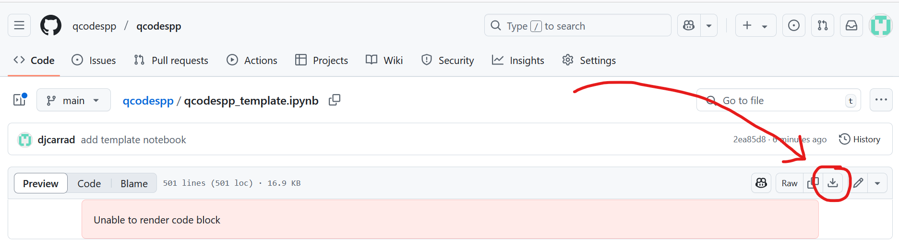

Example template
================

An example Jupyter notebook for running realistic measurements with qcodes++ is included with the installation, and is also available for download `here <https://github.com/qcodespp/qcodespp/blob/main/qcodespp_template.ipynb>`__.

    Click on the download icon in the top right corner.
      

The code
--------

.. code-block:: python

    # Optional: check for VISA instruments

    import qcodespp as qc
    qc.listVISAinstruments()

.. code-block:: python

    # Import packages, instrument drivers, and connect to instruments.

    import qcodespp as qc
    import numpy as np
    import time

    from qcodespp.instrument_drivers.QDevil.QDAC2 import QDac2
    from qcodespp.instrument_drivers.ZI.ZIHF2LI import ZIHF2LI
    from qcodespp.instrument_drivers.tektronix.Keithley_2450 import Keithley_2450

    qdac = QDac2('qdac','ASRL9::INSTR')
    li = ZIHF2LI('li','dev1832') # ZI instruments don't use VISA
    k2450 = Keithley_2450('k2450','TCPIP0::169.254.100.202::inst0::INSTR')

.. code-block:: python

    # Define custom parameters

    stepper=qc.Parameter('stepper',label='Stepper',unit='',set_cmd=lambda val: 0)

    currentX=qc.ScaledParameter(li.demod0_X,gain=1e-6,name='currentX',label='Current',unit='A')
    currentY=qc.ScaledParameter(li.demod0_Y,gain=1e-6,name='currentY',label='Current',unit='A')
    voltageX=qc.ScaledParameter(li.demod1_X,gain=1e-3,name='voltageX',label='Voltage',unit='V')
    voltageY=qc.ScaledParameter(li.demod1_Y,gain=1e-3,name='voltageY',label='Voltage',unit='V')

    resistance=qc.Parameter('resistance',label='Resistance',unit='Ohm',get_cmd=lambda: voltageX()/currentX())

    # Tell qcodespp where to store data
    qc.set_data_folder('data')

    # Init the station.
    station=qc.Station(add_variables=globals())

.. code-block:: python

    # 1D loops
    loop=qc.loop1d(sweep_parameter=qdac.ch01.volt,
               start=0,stop=1,num=101,delay=0.03,
               device_info='Device1',
               instrument_info=f'ACdiv=1e5 DCdiv=1e3 freq={li.osc0_freq():.6g} Hz',
               measure=[currentX, currentY, voltageX, voltageY, resistance],
               plot=[currentX,voltageX,resistance])

.. code-block:: python

    data = loop.run()

.. code-block:: python

    # 1D loop with a break condition
    loop=qc.loop1d(sweep_parameter=k2450.volt,
                start=0,stop=1,num=101,delay=0.03,
                device_info='Device1',
                instrument_info=f'ACdiv=1e5 DCdiv=1e3 freq={li.osc0_freq():.6g} Hz',
                measure=[qc.BreakIf(lambda: np.abs(k2450.curr())>1e-9), 
                            currentX, currentY, voltageX, voltageY, resistance],
                plot=[currentX,voltageX,resistance])

.. code-block:: python

    data = loop.run()

.. code-block:: python

    # 2D loop
    loop=qc.loop2d(sweep_parameter=qdac.ch01.volt,
                    start=0,stop=1,num=11,delay=0.03,
                    step_parameter=k2450.volt,
                    step_start=0,step_stop=1,step_num=11,step_delay=0.1,
                    device_info='Device1',
                    instrument_info=f'ACdiv=1e5 DCdiv=1e3 freq={li.osc0_freq():.6g} Hz',
                    measure=[currentX, currentY, voltageX, voltageY, resistance],
                    plot=[currentX,voltageX,resistance])

.. code-block:: python

    data = loop.run()

.. code-block:: python

    # 2D loops with sweep in both directions.
    loop=qc.loop2dUD(sweep_parameter=qdac.ch01.volt,
                    start=0,stop=1,num=11,delay=0.03,
                    step_parameter=k2450.volt,
                    step_start=0,step_stop=1,step_num=11,step_delay=0.1,
                    device_info='Device1',
                    instrument_info=f'ACdiv=1e5 DCdiv=1e3 freq={li.osc0_freq():.6g} Hz',
                    measure=[currentX, currentY, voltageX, voltageY, resistance],
                    plot=[currentX,voltageX,resistance])

.. code-block:: python

    data = loop.run()